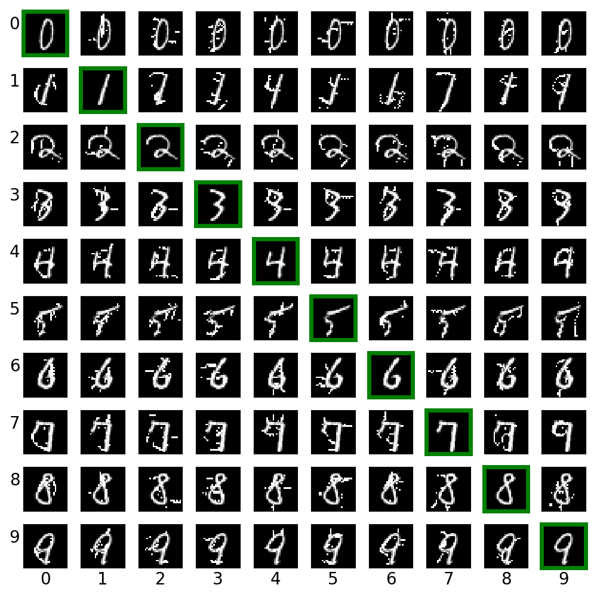
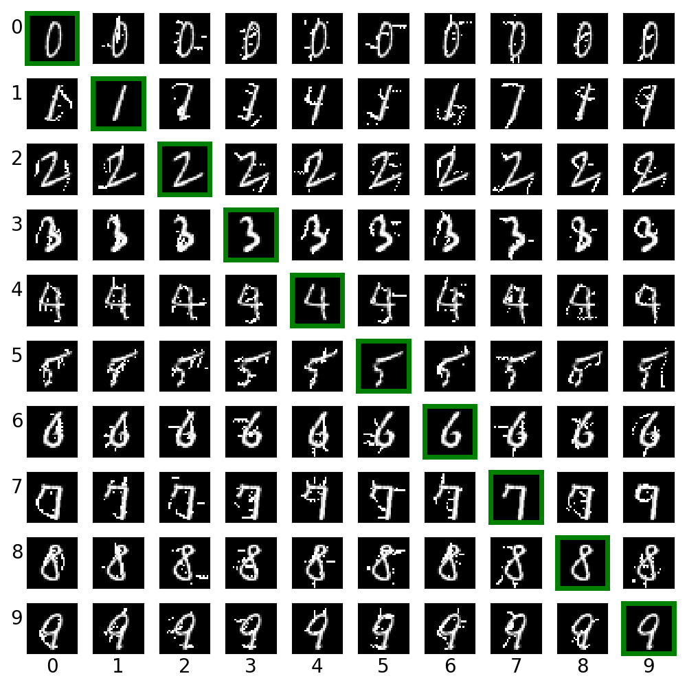

Craft Image Adversarial Samples with Tensorflow
===============================================

## Table of Contents

1. [API](#api)
2. [Dependencies](#dependencies)
3. [The `model`](#the-model)
4. [How to Use](#how-to-use)
5. [Results](#results)
6. [Future Work](#future-work)
7. [Related Work](#related-work)

This repo contains [adversarial image](https://arxiv.org/abs/1312.6199) crafting algorithms implemented in
Tensorflow.  The algorithms can be found in [attacks](attacks) folder.  The
implementation adheres to the principle **tensor-in, tensor-out**.  They all
return a Tensorflow operation which could be run through `sess.run(...)`.

## API

- Fast Gradient Method (FGM) [basic](https://arxiv.org/abs/1412.6572/)/[iterative](https://arxiv.org/abs/1607.02533)

  ```python
  fgsm(model, x, eps=0.01, epochs=1, sign=True, clip_min=0.0, clip_max=1.0)
  ```

  If `sign=True`, use gradient sign as noise, otherwise use gradient values
  directly.  Empirically gradient sign works better.

- Fast Gradient Method with Target (FGMT)

  ```python
  fgmt(model, x, y=None, eps=0.01, epochs=1, sign=True, clip_min=0.0, clip_max=1.0):
  ```

  The only difference from FGM is that this is a targeted attack, i.e., a
  desired target can be provided.  If `y=None`, this implements the least-likely
  class method.

- [Jacobian-based Saliency Map Approach (JSMA)](https://arxiv.org/abs/1511.07528)

  ```python
  jsma(model, x, y, epochs=1.0, eps=1., clip_min=0.0, clip_max=1.0,
       score_fn=lambda t, o: t * tf.abs(o))
  ```

  `y` is the target label, could be an integer or a list.  when `epochs` is a
  floating number in the range `[0, 1]`, it denotes the maximum percentage
  distortion allowed and `epochs` is automatically deduced.  `k` denotes the
  number of pixels to change at a time, should only be 1 or 2.  `score_fn` is
  the function used to calculate the saliency score, default to be `dt/dx *
  (-do/dx)`, could also be `dt/dx - do/dx`.

- [DeepFool](https://arxiv.org/abs/1511.04599)

  ```python
  deepfool(model, x, noise=False, eta=0.01, epochs=3, clip_min=0.0, clip_max=1.0, min_prob=0.0)
  ```

  If `noise` is `True`, the return value is `xadv, noise`, otherwise only `xadv`
  is returned.  Note that in my implementation, the noise if calculated as
  `f/||w|| * w` instead of `f/||w|| * w/||w||`, where `||w||` is the L2 norm.
  It seems that `||w||` is so small such that noise will explode when adding
  it.  In the [original author's implementation](https://github.com/LTS4/DeepFool/blob/master/Python/deepfool.py#L71), they add a small value 1e-4
  for numeric stability, I guess we might have similar issue here.  Anyway, this
  factor does not change the direction of the noise, and in practice, the
  adversarial noise is still subtle and hard to notice.

## Dependencies

1. Python3, samples codes uses many of the Python3 features.
2. Numpy, only needed in sample codes.
3. Tensorflow, tested with Tensorflow 1.4.

## The `model`

Notice that we have `model` as the first parameter for every method.  The
`model` is a wrapper function.  It should have the following signature

```python
def model(x, logits=False):
  # x is the input to the network, usually a tensorflow placeholder
  ybar = ...                    # get the prediction
  logits_ = ...                 # get the logits before softmax
  if logits:
    return y, logits
  return y
```

We need the logits because some algorithms (FGSM and TGSM) rely on the logits to
compute the loss.

## How to Use

Implementation of each attacking method is self-contained, and depends only on
TensorFlow.  Copy the attacking method file to the same folder as your source
code and import it.

The implementation should work on any framework that is **compatible** with
Tensorflow.  Examples are provided in [examples](examples) folder, each example
is *self-contained*.

## Results

- Fast gradient sign method adversarial on MNIST.

  

- Fast gradient value method adversarial on MNIST.

  

- DeepFool generate adversarial images.

  

- JSMA generates cross label adversarial on MNIST.  Labels on the left are the
  true labels, labels on the bottom are predicted labels by the model.

  

- JSMA generates cross label adversarial on MNIST, with difference as saliency
  function, i.e., `dt/dx - do/dx`.

  

- JSMA generates adversarial images from blank images.

  

## Future Work

- [ ] Add ImageNet examples
- [x] Add Deepfool
- [ ] Add attack method from https://arxiv.org/abs/1507.00677
- [ ] Add attack method from https://arxiv.org/abs/1608.04644
- [ ] Add houdini attack from https://arxiv.org/abs/1707.05373
- [ ] Add benchmark for various defense methods.  There are so many of them,
  probably need a good survey, e.g. https://arxiv.org/abs/1705.07263.

## Related Work

- [openai/cleverhans](https://github.com/openai/cleverhans)
